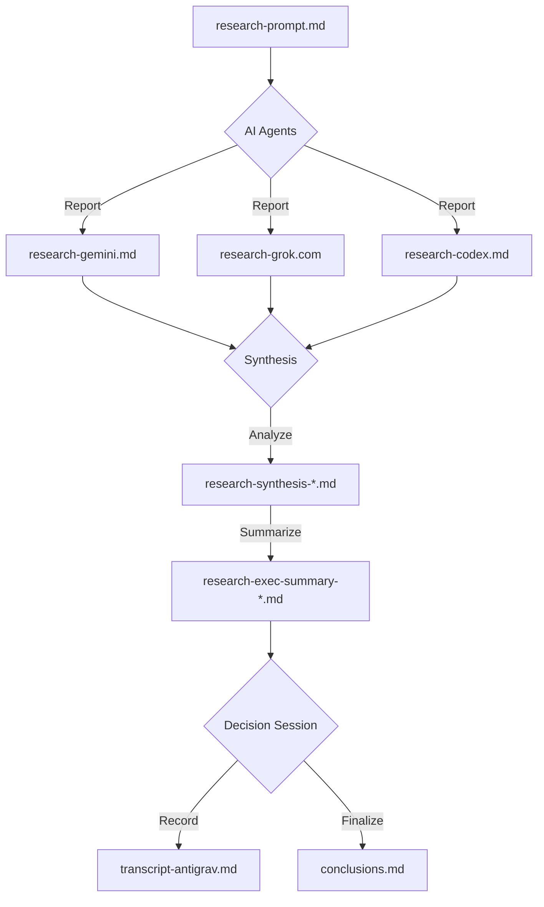

## CodeRabbit Research Capsule

This directory contains a self-contained research capsule for evaluating **CodeRabbit** on the BMAD Method repo.

### Files

| File | Description |
|------|-------------|
| `research-prompt.md` | Original research brief (questions, goals, deliverables) |
| `research-gemini.md` | Research report from Gemini |
| `research-grok.com` | Research report from Grok |
| `research-codex.md` | Research report from Codex |
| `research-synthesis-prompt.md` | Prompt that defines how to synthesize the reports |
| `research-synthesis-adversarial-review-prompt.md` | Prompt for adversarial/critical review of synthesis |
| `exec-summary-prompt.md` | Prompt for generating executive summaries |
| `research-synthesis-codex.md` | Synthesis by Codex |
| `research-synthesis-opus.md` | Synthesis by Opus |
| `research-synthesis-antigrav.md` | Synthesis by Antigravity (Gemini) |
| `research-exec-summary-codex.md` | Executive summary by Codex |
| `research-exec-summary-opus.md` | Executive summary by Opus |
| `research-exec-summary-antigrav.md` | Executive summary by Antigravity (Gemini) |
| `transcript-antigrav.md` | Verbatim transcript of the final decision session |
| `conclusions.md` | **Final Decision Record**: The agreed plan, risks, configuration strategy, and constraints. |

### Flow

